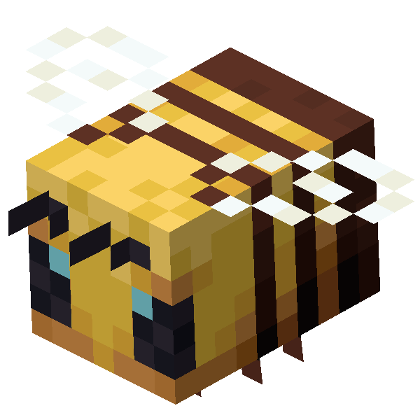

<div align="center">
  
  <h1>🐝 Bee Clicker</h1>
  <p><em>Un jeu incrémental web addictif dans l'univers de Minecraft, propulsé par React et Firebase.</em></p>
</div>

---

## 🎮 À propos du jeu

**Bee Clicker** est un jeu de type "Cookie Clicker" (ou *idle game*) où le but est de récolter un maximum de miel. Cliquez sur l'abeille centrale pour amasser vos premières gouttes, puis investissez dans des améliorations pour automatiser votre production et bâtir le plus grand empire apicole du serveur !

## ✨ Fonctionnalités

*   **Système de progression complet** : Achetez des améliorations de clic (Fleurs, Équipements) et des améliorations de production passive (Ruches, Apiculteurs).
*   **Animations dynamiques** : Plus vous récoltez de miel, plus de petites abeilles viennent envahir votre écran en arrière-plan (animées avec **GSAP**).
*   **Sauvegarde dans le Cloud** : Votre progression est automatiquement sauvegardée toutes les 30 secondes et synchronisée sur votre compte. Impossible de perdre votre précieux miel !
*   **Système de Connexion Privé** : Accès au jeu sécurisé via **Google Auth** et un système de **Clé de Licence** unique.
*   **Classement Mondial (Leaderboard)** : Affrontez vos amis et les autres joueurs en temps réel.
*   **Panel Administrateur** : Un tableau de bord réservé à l'admin pour générer de nouvelles clés d'accès et gérer les utilisateurs.
*   **Design Rétro / Minecraft** : Interfaces, polices pixel-art, boutons et menus entièrement inspirés de Minecraft (en pur CSS).

## 🛠️ Technologies Utilisées

*   **Frontend** : [React 18](https://react.dev/) + [Vite](https://vitejs.dev/)
*   **Styling** : CSS Vanilla (Custom Design System Minecraft)
*   **Animations** : [GSAP](https://gsap.com/)
*   **Backend & Base de données** : [Firebase](https://firebase.google.com/) (Auth & Firestore)

## 🚀 Installation & Lancement

1.  **Prérequis** : Assurez-vous d'avoir [Node.js](https://nodejs.org/) installé sur votre machine.
2.  **Ouvrez le dossier du projet** dans votre terminal.
3.  **Installez les dépendances** :
    ```bash
    npm install
    ```
4.  **Configuration Firebase** : 
    Assurez-vous que votre projet Firebase est bien relié dans le fichier `src/firebase.js` et que les règles **Firestore** sont correctement configurées (voir section ci-dessous).
5.  **Lancement du jeu** :
    ```bash
    npm run dev
    ```
    Ouvrez ensuite votre navigateur sur [http://localhost:5173/](http://localhost:5173/)

## 📜 Règles de Sécurité Firestore

Pour que le jeu fonctionne (sauvegardes, profils, système de clés), votre base de données Firestore doit posséder ces règles :

```javascript
rules_version = '2';
service cloud.firestore {
  match /databases/{database}/documents {
    match /users/{userId} {
      allow read: if request.auth != null;
      allow write: if request.auth != null && request.auth.uid == userId;
    }
    match /saves/{userId} {
      allow read: if request.auth != null;
      allow write: if request.auth != null && request.auth.uid == userId;
    }
    match /licenseKeys/{keyId} {
      allow read: if true;
      allow write: if true; 
    }
  }
}
```

## 👨‍💻 Développé par

Créé avec 💛 (et beaucoup de miel) par **Foxy**.
